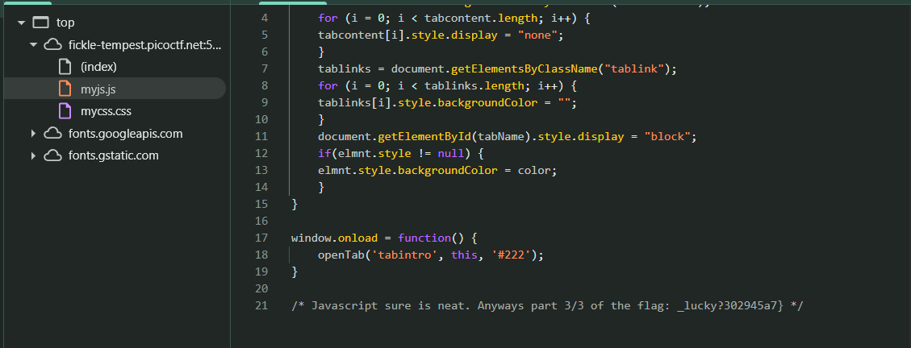

# Insp3ct0r

- **Kategori:** Web Exploitation
- **Tingkat Kesulitan:** Easy
- **Platform:** picoCTF 2019

## Deskripsi
Kishor Balan tipped us off that the following code may need inspection:
`http://fickle-tempest.picoctf.net:50748`

**Hints:**
1. How do you inspect web code on a browser?
2. There's 3 parts

## Solusi

1. **Analisis Awal**
   Berdasarkan nama *challenge* dan petunjuk pertama, kita diarahkan untuk melakukan inspeksi (*inspect element* / *view page source*) pada kode web. Petunjuk kedua secara eksplisit menyatakan bahwa *flag* ini dipecah menjadi 3 bagian.

2. **Inspeksi HTML (Bagian 1)**
   Dengan menggunakan *Developer Tools* dan memeriksa elemen `<body>` pada *source code* HTML, kita menemukan komentar yang menyembunyikan 1/3 bagian pertama dari *flag*.
   - Bagian 1: `picoCTF{tru3_d3`

   

3. **Inspeksi CSS (Bagian 2)**
   Situs web biasanya memuat file CSS. Melalui tab *Sources* di *Developer Tools*, terlihat ada file bernama `mycss.css`. Jika kita menginspeksi file tersebut, kita akan menemukan 1/3 bagian kedua dari *flag* di dalam sebuah komentar CSS di baris paling bawah.
   - Bagian 2: `t3ct1ve_0r_ju5t`

   

4. **Inspeksi JavaScript (Bagian 3)**
   Terakhir, situs ini juga memuat file `myjs.js`. Dengan membuka file tersebut di tab *Sources*, terdapat komentar JavaScript di baris paling bawah yang memuat 1/3 bagian terakhir dari *flag*.
   - Bagian 3: `_lucky?302945a7}`

   

5. **Menyatukan Flag**
   Gabungkan ketiga bagian yang ditemukan dari file HTML, CSS, dan JS secara berurutan untuk mendapatkan *flag* utuh.

## Flag
`picoCTF{tru3_d3t3ct1ve_0r_ju5t_lucky?302945a7}`
